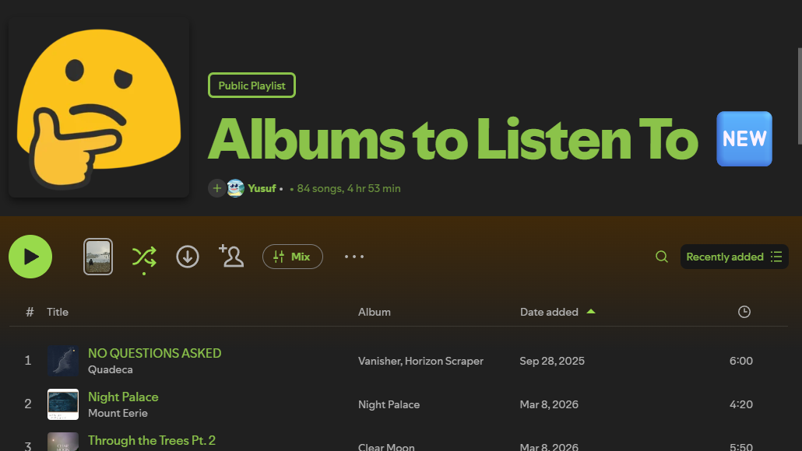

# Album Length

A [Spicetify](https://spicetify.app/) extension that surfaces the length of each track's source album / EP inline in playlists, Liked Songs, and the Queue — so you can see at a glance how long the whole project is without clicking into the album.



## Why

If you keep playlists made of tracks pulled from different albums and EPs, Spotify shows you the track duration but never the album duration. To know whether a song belongs to a 22-minute EP or a 70-minute LP, you have to click into the album. This extension shows that number where you can already see the album name.

## Features

- Inline badge appended to the existing **Album** cell in tracklists (e.g. `Currents · 51m`).
- Works in **Playlists**, **Liked Songs**, and the **Queue** — toggle each surface independently.
- Format options: `42m` / `1h 23m`, `42:13`, `1 hour 23 minutes`, or auto-hybrid.
- Tooltip mode if you'd rather see the length on hover.
- Singles auto-hidden — when a track *is* the album, the redundant badge is suppressed.
- Album durations are cached indefinitely (album lengths don't change). Cache lives in `Spicetify.LocalStorage`.
- Settings live in the **profile menu** (top-right avatar dropdown → "Album Length").

## Install

Manual install:

1. Copy `album-length.js` into your Spicetify Extensions folder:
   - Windows: `%APPDATA%\spicetify\Extensions\album-length.js`
   - macOS / Linux: `~/.config/spicetify/Extensions/album-length.js`
2. Enable it:
   ```
   spicetify config extensions album-length.js
   spicetify apply
   ```

## Settings

Open the Spotify profile dropdown (top-right) → **Album Length**.

| Setting | Description |
| --- | --- |
| Display mode | `Inline` (default), `Tooltip`, or `Column` (coming soon) |
| Format | `Short` (`1h 23m`), `Colon` (`1:23:00`), `Long` (`1 hour 23 minutes`), `Auto` |
| Show on | Playlists / Liked Songs / Queue — toggle each |
| Hide singles | Suppresses the badge for 1-track "albums" (default on) |
| Clear cache | Forces a refetch of all album durations |

## How it works

Each tracklist row contains a link to the album it came from (`/album/<id>`). When the row is rendered, the extension extracts that id, fetches the album's track list via Spicetify's internal Cosmos endpoint (`wg://album/v1/album-app/album/<id>/desktop`), sums the track durations, and writes the total into `LocalStorage`. Cached entries are reused indefinitely. A single `MutationObserver` on the main view container handles re-injection when Spotify re-renders rows.

## License

MIT — see [LICENSE](LICENSE).
